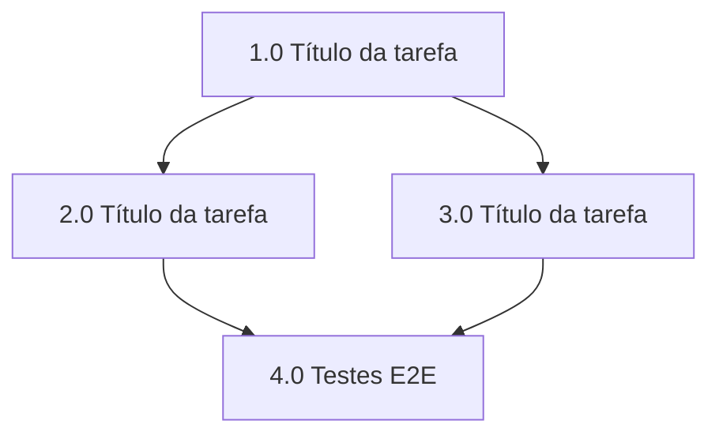

# Resumo das tarefas de implementação de [Funcionalidade]

## Tarefas

- [ ] 1.0 Título da tarefa
- [ ] 2.0 Título da tarefa
- [ ] 3.0 Título da tarefa

## Sequenciamento e Paralelismo

<!--
Descreva a ordem de execução das tarefas e o que pode ser feito em paralelo.
Regras:
- Liste, para cada tarefa, de quais outras ela depende (use "—" quando não houver).
- Agrupe em "ondas" as tarefas sem dependências entre si (podem rodar em paralelo).
- Justifique brevemente cada dependência (ex.: precisa do client/auth antes das tools).
- Mantenha o diagrama Mermaid sincronizado com a tabela.
-->

### Dependências

| Tarefa | Depende de | Pode rodar em paralelo com | Observação |
| ------ | ---------- | -------------------------- | ---------- |
| 1.0    | —          | —                          | Base/infra |
| 2.0    | 1.0        | 3.0                        |            |
| 3.0    | 1.0        | 2.0                        |            |

### Ondas de execução (paralelismo)

- **Onda 1 (sequencial, base):** 1.0
- **Onda 2 (paralelo):** 2.0, 3.0
- **Onda 3 (sequencial, integração):** [ex.: testes E2E após 2.0 e 3.0]

### Diagrama de dependências

<!--
Convenções do diagrama:
- Um nó por tarefa principal (X.0), rotulado com número + título curto.
- Uma aresta A --> B significa "B depende de A" (A vem antes).
- Tarefas sem aresta entre si podem ser executadas em paralelo.
- Opcional: use subgraph para destacar as ondas de paralelismo.
-->

