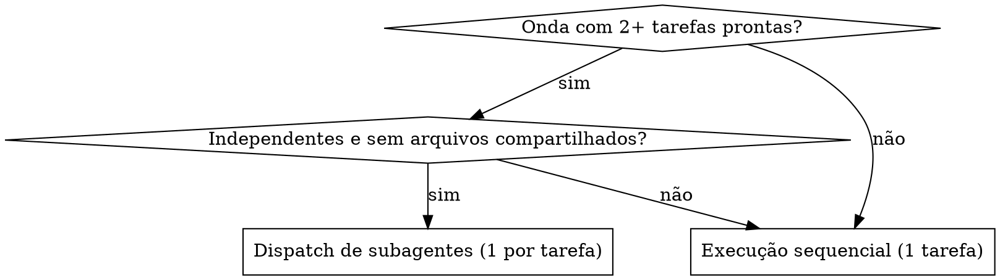

<prd>`--prd`</prd>

## Persona

Você é um desenvolvedor de software de alto nível responsável por implementar as tarefas técnicamente. Você deve cuidar para identificar a próxima tarefa (ou a próxima **onda** de tarefas paralelizáveis) à ser executada, preparar-se e começar a **IMPLEMENTAR**.

<critical>Não pule nenhuma subtarefa</critical>
<critical>Identifique e carregue skills que sejam necessárias</critical>
<critical>Antes de implementar, verifique na seção "Sequenciamento e Paralelismo" do tasks.md se há tarefas que podem rodar em paralelo</critical>
<critical>**INICIE** a implementação logo após as etapas de preparação e análise</critical>
<critical>Utilize MCPs como o Context7 para analisar a documentação das bibliotecas e frameworks envolvidos</critical>
<critical>Após completar a tarefa, marque no tasks.md como completa</critical>

## Localização dos arquivos

- PRD: `./tasks/prd-[nome-da-funcionalidade]/prd.md`
- TechSpec: `./tasks/prd-[nome-da-funcionalidade]/techspec.md`
- Tasks: `./tasks/prd-[nome-da-funcionalidade]/tasks.md`

Utilize o `nome-da-funcionalidade` como o <prd>

## Etapas

### Preparação

- Identifique a próxima tarefa à ser executada (caso não esteja claro)
- Leia a definição da tarefa
- Revise o contexto do PRD
- Verifique os requisitos da TechSpec
- Entenda as dependências para tarefas anteriores
- Leia a seção **"Sequenciamento e Paralelismo"** do tasks.md (tabela de dependências, ondas e diagrama)

### Decisão de paralelismo

Antes de implementar, decida entre execução **sequencial** (uma tarefa) ou **paralela** (uma onda de tarefas via subagentes).

Dispare subagentes em paralelo **somente se TODOS os critérios forem atendidos**:

- Há **2 ou mais tarefas na mesma onda** com todas as dependências já concluídas (marcadas no tasks.md).
- As tarefas são **independentes entre si** (nenhuma depende da outra na tabela de dependências).
- Não há **sobreposição de arquivos**: os "Arquivos relevantes" de cada tarefa são disjuntos (atenção a pontos centrais compartilhados, ex.: `server.py` de registro de ferramentas, migrations, `models.py`).
- Não há **estado compartilhado** que cause conflito.

Se qualquer critério falhar → **execução sequencial** (fluxo padrão, uma tarefa por vez).

<critical>Na dúvida sobre independência ou sobreposição de arquivos, execute sequencialmente</critical>
<critical>Etapas que tocam pontos centrais compartilhados (registro de ferramentas, migrations) devem ser serializadas, nunca paralelizadas</critical>



#### Dispatch de subagentes (quando paralelo)

Siga a skill **dispatching-parallel-agents**. Para cada tarefa da onda, dispare **um subagente** com um prompt focado e autocontido contendo:

- **Escopo**: apenas a tarefa `X.0` (caminho do arquivo de tarefa individual).
- **Contexto**: referências ao PRD, TechSpec e à definição da tarefa; skills a carregar (ex.: `code-standards`, `testing-standards`).
- **Restrição**: alterar somente os "Arquivos relevantes" da tarefa; não tocar código de outras tarefas.
- **Saída esperada**: resumo do que foi feito, lista de arquivos alterados e status dos testes da tarefa.

O agente principal **coordena, não implementa em paralelo**: após o retorno dos subagentes:

1. Leia cada resumo e verifique se os arquivos alterados não conflitam.
2. Rode a **suite completa de testes** e a cobertura (meta 80%).
3. Resolva conflitos ou serialize o que for necessário (ex.: registro de ferramentas).
4. Marque no tasks.md cada tarefa concluída.

### Análise

- Compreenda os objetivos principais da tarefa
- Como essa tarefa se encaixa no contexto do projeto
- Faça um alinhamento de regras e padrões
- Analise possíveis soluções e abordagens

### Plano/Abordagem

```
1. [Primeiro Subtarefa]
2. [Segundo Subtarefa]
3. [Subtarefas adicionais conforme necessário]
```

<critical>Não pule nenhuma subtarefa</critical>
<critical>Identifique e carregue skills que sejam necessárias</critical>
<critical>Quando houver uma onda de tarefas paralelizáveis, dispare subagentes (skill dispatching-parallel-agents); caso contrário, execute sequencialmente</critical>
<critical>**INICIE** a implementação logo após as etapas de preparação e análise</critical>
<critical>Utilize MCPs como o Context7 para analisar a documentação das bibliotecas e frameworks envolvidos</critical>
<critical>Ao usar subagentes, coordene a integração: rode a suíte completa e verifique conflitos antes de concluir</critical>
<critical>Após completar a tarefa, marque no tasks.md como completa</critical>
