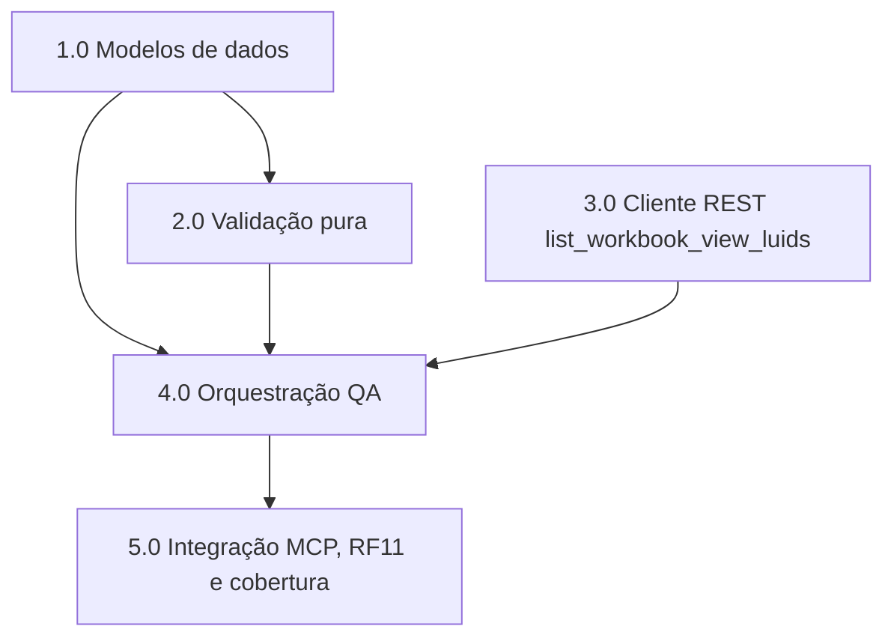

# Resumo das tarefas de implementação de Enriquecer saídas com IDs

## Tarefas

- [x] 1.0 Modelos de dados — `SheetRef`, `StructureReport` e `FilterInfo`
- [x] 2.0 Camada de validação pura — `structure.py` e `complexity.py`
- [x] 3.0 Cliente REST — `list_workbook_view_luids`
- [x] 4.0 Orquestração na ferramenta QA — enriquecimento best-effort e contrato
- [x] 5.0 Integração MCP, verificação RF11 e cobertura

## Sequenciamento e Paralelismo

### Dependências

| Tarefa | Depende de | Pode rodar em paralelo com | Observação |
| ------ | ---------- | -------------------------- | ---------- |
| 1.0    | —          | 3.0                        | Base de tipos; quebra de contrato isolada e testável primeiro. |
| 2.0    | 1.0        | 3.0                        | Validação pura precisa do tipo `SheetRef`/`worksheet_id`. |
| 3.0    | —          | 1.0, 2.0                   | Método do cliente retorna `dict[str, str]`; não depende de `SheetRef`. |
| 4.0    | 1.0, 2.0, 3.0 | —                       | Orquestra parse (2.0) + mapa de LUIDs (3.0) sobre os tipos (1.0). |
| 5.0    | 4.0        | —                          | Integração/contrato e cobertura só após o fluxo completo. |

### Ondas de execução (paralelismo)

- **Onda 1 (paralelo):** 1.0, 3.0
- **Onda 2 (sequencial):** 2.0 (após 1.0)
- **Onda 3 (sequencial, orquestração):** 4.0 (após 1.0, 2.0, 3.0)
- **Onda 4 (sequencial, integração/cobertura):** 5.0 (após 4.0)

### Diagrama de dependências

