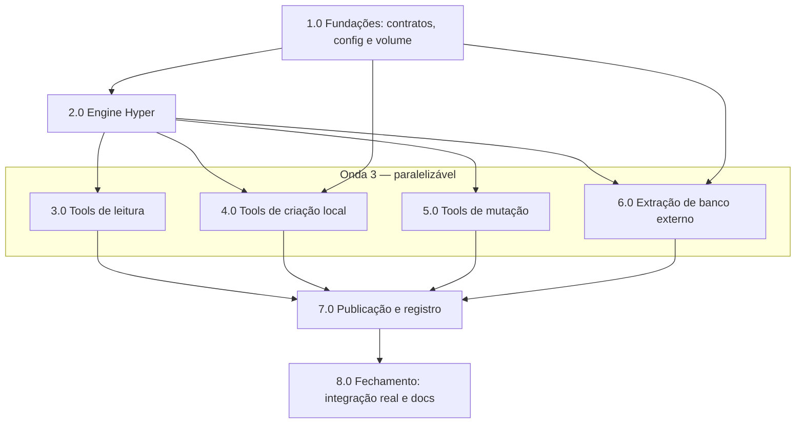

# Resumo das tarefas de implementação de Hyper Datasources

Feature: **Capacidade 5 — Hyper Datasources** — sete novas tools MCP (mais extensão da `publish_datasource`) cobrindo o ciclo de vida local de extratos `.hyper`: criação (arquivo/inline/banco externo), consulta SQL, inspeção de schema, append/transformação e publicação.

Documentos de referência:

- PRD: `tasks/prd-hyper-datasources/prd.md`
- TechSpec: `tasks/prd-hyper-datasources/techspec.md`

## Tarefas

- [x] 1.0 Fundações: contratos, config e salvaguardas de volume
- [x] 2.0 Engine Hyper (`hyper/engine.py`)
- [x] 3.0 Tools de leitura: `inspect_hyper_schema` e `query_hyper`
- [x] 4.0 Tools de criação local: `create_hyper_from_file` e `create_hyper_from_inline`
- [x] 5.0 Tools de mutação: `append_to_hyper` e `execute_hyper_sql`
- [x] 6.0 Extração de banco externo: `hyper/db.py` e `extract_database_to_hyper`
- [x] 7.0 Publicação `.hyper` e registro no servidor
- [x] 8.0 Fechamento: testes de integração reais e documentação

## Sequenciamento e Paralelismo

### Dependências

| Tarefa | Depende de | Pode rodar em paralelo com | Observação |
| ------ | ---------- | -------------------------- | ---------- |
| 1.0    | —          | —                          | Base: contratos, `ErrorCode`, limiares e regras puras de volume destravam todo o restante. |
| 2.0    | 1.0        | —                          | Engine usa os contratos/`ErrorCode` de 1.0; adiciona dependência `tableauhyperapi` no `pyproject.toml`. |
| 3.0    | 2.0        | 4.0, 5.0, 6.0              | Primeira tool em `tools/hyper.py`: cria o arquivo e o `register(mcp)`; estabelece o padrão. Paralelismo com 4.0/5.0 exige coordenação no mesmo arquivo `tools/hyper.py`. |
| 4.0    | 2.0, 1.0   | 3.0, 5.0, 6.0              | Usa `VolumeAlert`/`validation/volume.py` de 1.0 e engine de 2.0. Mesmo arquivo de 3.0/5.0. |
| 5.0    | 2.0        | 3.0, 4.0, 6.0              | Reutiliza engine e validações; mesmo arquivo de 3.0/4.0. |
| 6.0    | 2.0, 1.0   | 3.0, 4.0, 5.0              | `hyper/db.py` é módulo novo isolado (sem conflito de arquivo); a tool entra em `tools/hyper.py`. Adiciona `sqlalchemy` ao `pyproject.toml`. |
| 7.0    | 3.0, 4.0, 5.0, 6.0 | —                  | Registro no `server.py` e teste "17 tools" exigem as sete tools prontas; extensão de `publish_datasource` é independente, mas agrupada aqui. |
| 8.0    | 7.0        | —                          | Testes `integration` reais e documentação fecham a feature com tudo integrado. |

### Ondas de execução (paralelismo)

- **Onda 1 (sequencial, base):** 1.0
- **Onda 2 (sequencial, engine):** 2.0
- **Onda 3 (paralelo, tools):** 3.0, 4.0, 5.0, 6.0 — 6.0 é o mais isolado (módulo `hyper/db.py` próprio); 3.0/4.0/5.0 compartilham `tools/hyper.py` e `tests/tools/test_hyper.py`, exigindo merges coordenados se executadas simultaneamente. Recomendação prática: 3.0 primeiro (cria o arquivo e o padrão), depois 4.0 ∥ 5.0 ∥ 6.0.
- **Onda 4 (sequencial, integração):** 7.0
- **Onda 5 (sequencial, fechamento):** 8.0

### Diagrama de dependências

