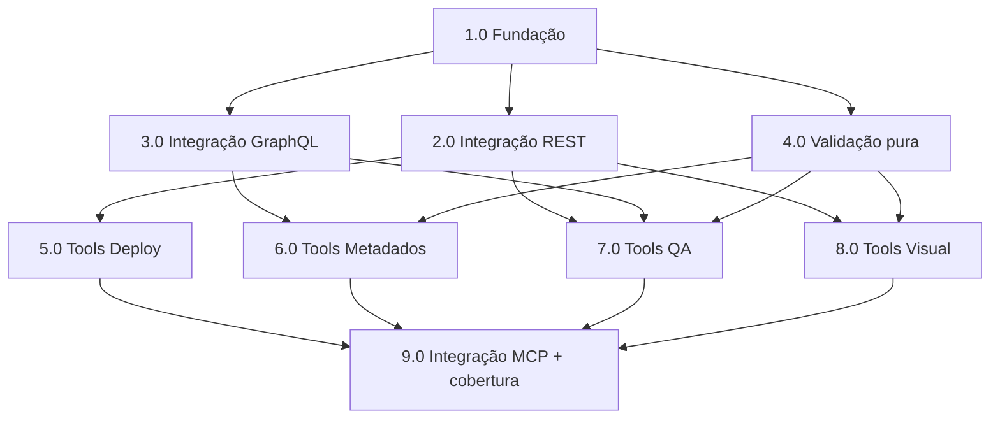

# Resumo das tarefas de implementação de MCP Tableau

## Tarefas

- [x] 1.0 Fundação do projeto (config, models, server, dependências)
- [ ] 2.0 Camada de integração REST (`tableau/client.py`)
- [ ] 3.0 Camada de integração GraphQL (`tableau/metadata.py`)
- [ ] 4.0 Camada de validação pura (`validation/*`)
- [ ] 5.0 Tools — Capacidade 1 Deploy (`tools/deploy.py`)
- [ ] 6.0 Tools — Capacidade 4 Metadados (`tools/metadata.py`)
- [ ] 7.0 Tools — Capacidade 3 QA (`tools/qa.py`)
- [ ] 8.0 Tools — Capacidade 2 Visual (`tools/visual.py`)
- [ ] 9.0 Integração MCP in-memory e cobertura ≥80%

## Sequenciamento e Paralelismo

A ordem segue o § "Sequenciamento do desenvolvimento" da techspec: fundação (config + contratos)
→ camadas de integração e validação → tools por capacidade → integração MCP e cobertura.

As camadas `validation/*` são puras (sem rede) e dependem apenas de `models.py` (Tarefa 1.0),
por isso podem ser construídas em paralelo às camadas de integração. As tools são finas e
orquestram integração + validação, por isso dependem das tarefas correspondentes.

### Dependências

| Tarefa | Depende de | Pode rodar em paralelo com | Observação |
| ------ | ---------- | -------------------------- | ---------- |
| 1.0    | —          | —                          | Base/infra; tudo depende dos contratos Pydantic e da config. |
| 2.0    | 1.0        | 3.0, 4.0                   | `TableauClient` (REST): auth PAT, publish, download, render. |
| 3.0    | 1.0        | 2.0, 4.0                   | `MetadataClient` (GraphQL): linhagem, dicionário, candidatos. |
| 4.0    | 1.0        | 2.0, 3.0                   | Funções puras; só precisam dos modelos. |
| 5.0    | 2.0        | 6.0, 7.0, 8.0              | Deploy usa só REST. |
| 6.0    | 3.0, 4.0   | 5.0, 7.0, 8.0              | Metadados usa GraphQL + similaridade fuzzy. |
| 7.0    | 2.0, 3.0, 4.0 | 5.0, 6.0, 8.0           | QA = download (REST) + parse/complexidade (validação) + Metadata API. |
| 8.0    | 2.0, 4.0   | 5.0, 6.0, 7.0              | Visual = render (REST) + heurística (validação). |
| 9.0    | 5.0, 6.0, 7.0, 8.0 | —                  | Integração MCP in-memory + cobertura global ≥80%. |

### Ondas de execução (paralelismo)

- **Onda 1 (sequencial, base):** 1.0
- **Onda 2 (paralelo):** 2.0, 3.0, 4.0
- **Onda 3 (paralelo):** 5.0, 6.0, 7.0, 8.0
- **Onda 4 (sequencial, fechamento):** 9.0

### Diagrama de dependências

